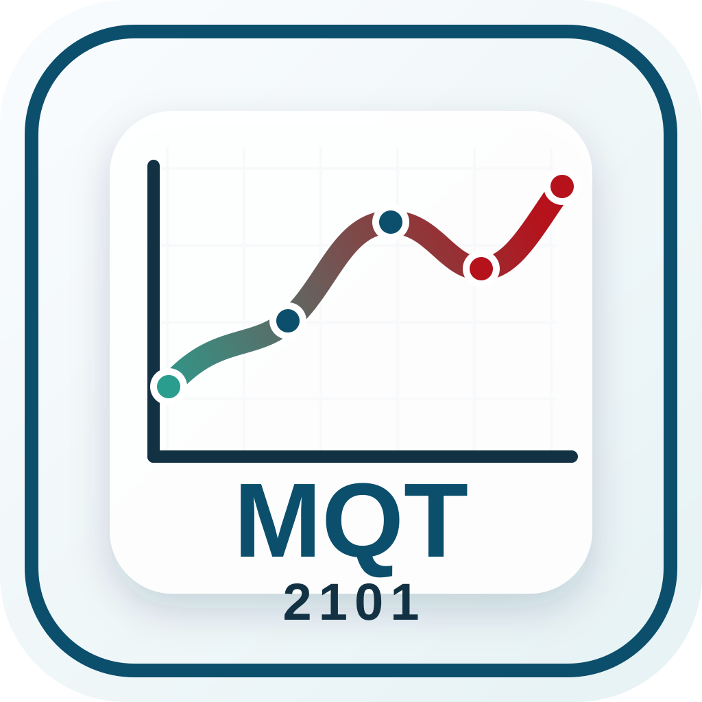

# Bienvenue

```{=html}
<div class="course-brand-lockup">
  
</div>
```

Ce site regroupe le matériel principal du cours MQT-2101. Le cours est centré sur l'analyse appliquée des données, la modélisation, la prévision et l'utilisation de R pour soutenir des décisions d'affaires.

## Assistant pédagogique IA

Le [GPT du cours](https://chatgpt.com/g/g-6a0b2ec33d948191ad25b2f247b15de1-analyse-et-modelisation-des-donnees?ref=mini) est disponible pour accompagner le travail personnel : clarifier une notion, comprendre une erreur R, relire une trace finale, vérifier une interprétation ou préparer une checklist de validation.

Il doit être utilisé selon les règles de la page [IA et apprentissage](ressources/ia.qmd). Il aide à apprendre, mais ne remplace pas la compréhension, la vérification ni le travail personnel.

## Objectif du site

Fournir une structure claire pour les modules, les ateliers, les notes, les capsules, les exercices, les évaluations, les jeux de données et les ressources du cours.

## Progression

Le cours commence par le diagnostic statistique et l'utilisation de R, puis avance vers la régression, la prévision, les séries chronologiques et les modèles de classification.

## Orientation appliquée

Les exemples et mini-cas privilégient des contextes utiles aux deux publics du cours : performance opérationnelle, systèmes, production, ventes, achalandage, campagnes marketing, satisfaction client, demande, inventaire, finance, ressources humaines et performance organisationnelle.

## Publics visés

La refonte du cours tient compte de deux publics principaux :

- les étudiant·es en génie;
- les étudiant·es en administration.

Les modules doivent donc montrer l'utilité des méthodes statistiques autant pour des problèmes de performance, d'opérations et de systèmes que pour des problèmes de gestion, de marketing, de finance et de décision organisationnelle.

## Modules et ateliers

Le cours distingue les modules et les ateliers. Les modules servent surtout à introduire ou structurer les notions. Les ateliers servent surtout à pratiquer dans un cas guidé et à produire une trace finale plus intégrée.

Chaque semaine est conçue comme un parcours autonome : capsules, exercices d'application, démonstrations R, exercices avec solutions cachées, lectures ciblées et trace finale.

La page [Principes de refonte](ressources/principes-refonte.qmd) décrit les choix pédagogiques qui guident la construction des modules et des ateliers.

```{r}
#| eval: false
# Exemple de point de départ pour une analyse business
library(tidyverse)

ventes <- readr::read_csv("donnees/preparees/ventes_pme.csv")

ventes |>
  group_by(mois) |>
  summarise(chiffre_affaires = sum(chiffre_affaires, na.rm = TRUE))
```

## À compléter

TODO: Ajouter une courte présentation du cours, les liens institutionnels pertinents et les consignes de navigation pour les étudiant·es.
