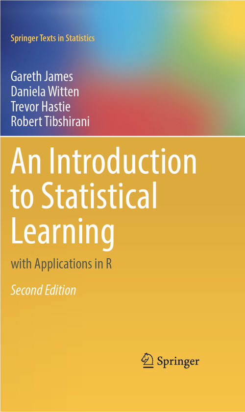
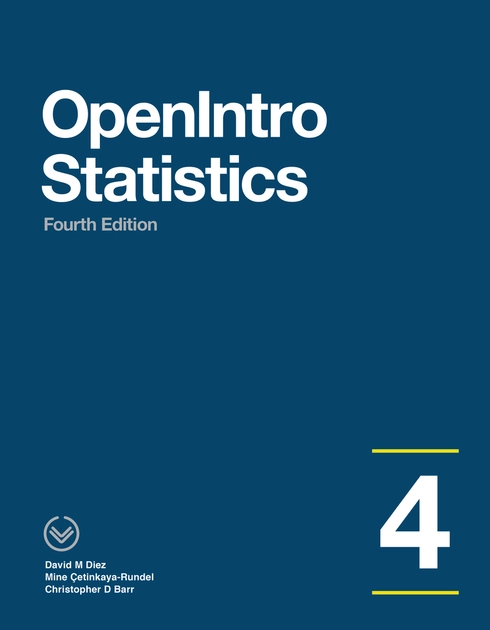
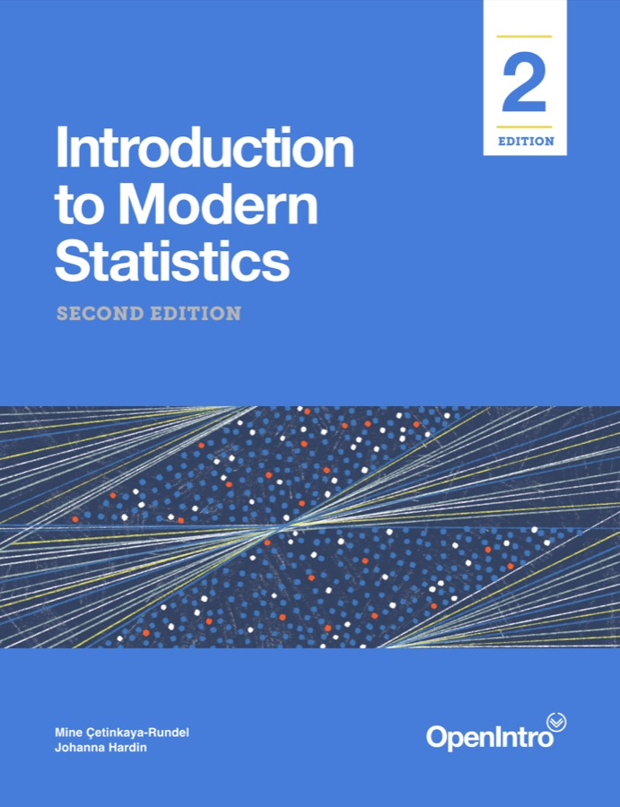
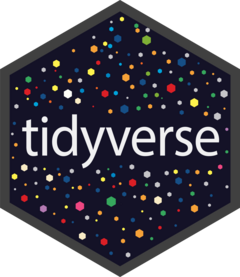

```{=html}
<style>
.readings-page {
  --reading-ink: #172231;
  --reading-muted: #5c6876;
  --reading-line: #dbe3ea;
  --reading-soft: #f5f8fb;
  --reading-blue: #0b5c75;
  --reading-teal: #0f766e;
  --reading-green: #4f7d39;
  --reading-gold: #a45f12;
  color: var(--reading-ink);
}

.readings-intro {
  max-width: 1120px;
  margin: 0 0 2rem;
  padding: 1.25rem 0 0;
}

.readings-intro-grid {
  display: grid;
  grid-template-columns: minmax(0, 1fr) 320px;
  gap: 1.4rem;
  align-items: center;
}

.readings-intro p {
  font-size: 1.08rem;
  line-height: 1.65;
  margin: 0 0 0.9rem;
}

.featured-covers {
  display: flex;
  align-items: center;
  justify-content: flex-end;
  gap: 0.45rem;
  min-height: 170px;
}

.featured-covers img {
  display: block;
  width: 92px;
  height: 136px;
  object-fit: cover;
  border-radius: 5px;
  box-shadow: 0 14px 28px rgba(23, 34, 49, 0.18);
  background: #fff;
}

.featured-covers img:nth-child(2) {
  width: 108px;
  height: 158px;
}

.reading-toolbar {
  display: grid;
  grid-template-columns: repeat(3, minmax(0, 1fr));
  gap: 0.8rem;
  margin: 1.4rem 0 2.4rem;
}

.reading-toolbar a {
  display: block;
  padding: 0.8rem 0.95rem;
  border: 1px solid var(--reading-line);
  border-left: 4px solid var(--reading-blue);
  border-radius: 8px;
  color: var(--reading-ink);
  text-decoration: none;
  background: #fff;
}

.reading-toolbar a:hover,
.reading-toolbar a:focus {
  border-color: var(--reading-blue);
  color: var(--reading-blue);
}

.reading-section {
  margin: 2.2rem 0 1.3rem;
}

.reading-section p {
  max-width: 900px;
  color: var(--reading-muted);
  line-height: 1.55;
}

.reading-grid {
  display: grid;
  grid-template-columns: repeat(2, minmax(0, 1fr));
  gap: 1.1rem;
  margin: 1.1rem 0 2.2rem;
}

.reading-card {
  display: grid;
  grid-template-columns: 132px minmax(0, 1fr);
  gap: 1rem;
  align-items: start;
  padding: 1rem;
  border: 1px solid var(--reading-line);
  border-radius: 8px;
  background: #fff;
  box-shadow: 0 10px 28px rgba(18, 37, 54, 0.06);
}

.reading-card.primary {
  border-top: 5px solid var(--reading-blue);
}

.reading-card.secondary {
  border-top: 5px solid var(--reading-teal);
}

.reading-cover-frame {
  display: flex;
  min-height: 190px;
  align-items: center;
  justify-content: center;
  padding: 0.65rem;
  border-radius: 7px;
  background: var(--reading-soft);
  border: 1px solid #e8eef4;
}

.reading-cover-frame img {
  display: block;
  max-width: 100%;
  max-height: 185px;
  object-fit: contain;
  border-radius: 4px;
  box-shadow: 0 10px 18px rgba(23, 34, 49, 0.18);
}

.reading-card-content {
  min-width: 0;
}

.reading-theme {
  margin: 0 0 0.35rem;
  color: var(--reading-blue);
  font-size: 0.82rem;
  letter-spacing: 0;
  text-transform: uppercase;
}

.reading-title {
  margin: 0 0 0.35rem;
  font-size: 1.32rem;
  line-height: 1.18;
  font-weight: 700;
  color: var(--reading-ink);
}

.reading-authors,
.reading-reference,
.reading-description,
.reading-level,
.reading-source {
  margin: 0 0 0.58rem;
  line-height: 1.48;
}

.reading-authors {
  color: #344151;
}

.reading-reference {
  color: var(--reading-muted);
  font-size: 0.92rem;
}

.reading-description {
  color: var(--reading-ink);
}

.reading-level {
  color: var(--reading-muted);
  font-size: 0.92rem;
}

.reading-source {
  color: var(--reading-muted);
  font-size: 0.82rem;
}

.reading-actions {
  display: flex;
  flex-wrap: wrap;
  gap: 0.45rem;
  margin: 0.8rem 0 0.6rem;
}

.reading-actions a,
.software-grid a {
  display: inline-flex;
  align-items: center;
  justify-content: center;
  min-height: 2.35rem;
  padding: 0.52rem 0.8rem;
  border-radius: 7px;
  border: 1px solid var(--reading-blue);
  background: var(--reading-blue);
  color: #fff;
  text-decoration: none;
  line-height: 1.1;
}

.reading-actions a.secondary-link {
  background: #fff;
  color: var(--reading-blue);
}

.reading-actions a:hover,
.reading-actions a:focus,
.software-grid a:hover,
.software-grid a:focus {
  filter: brightness(0.95);
  text-decoration: none;
}

.reading-path {
  display: grid;
  grid-template-columns: repeat(3, minmax(0, 1fr));
  gap: 1rem;
  margin: 1rem 0 2.2rem;
}

.path-card,
.software-panel {
  border: 1px solid var(--reading-line);
  border-radius: 8px;
  padding: 1rem;
  background: #fff;
}

.path-card h3,
.software-panel h3 {
  margin-top: 0;
  font-size: 1.1rem;
}

.path-card p {
  margin: 0;
  color: var(--reading-muted);
  line-height: 1.45;
}

.path-card .path-step {
  display: inline-flex;
  align-items: center;
  justify-content: center;
  width: 2rem;
  height: 2rem;
  margin-bottom: 0.7rem;
  border-radius: 999px;
  background: var(--reading-blue);
  color: #fff;
  font-weight: 700;
}

.software-grid {
  display: grid;
  grid-template-columns: repeat(3, minmax(0, 1fr));
  gap: 1rem;
  margin: 1rem 0;
}

.software-panel {
  display: flex;
  flex-direction: column;
  gap: 0.8rem;
}

.software-panel p {
  margin: 0;
  color: var(--reading-muted);
}

.package-library {
  margin: 2.2rem 0 0;
}

.package-library > p {
  max-width: 900px;
  color: var(--reading-muted);
  line-height: 1.55;
}

.package-grid {
  display: grid;
  grid-template-columns: repeat(3, minmax(0, 1fr));
  gap: 1rem;
  margin: 1rem 0 0;
}

.package-card {
  display: grid;
  grid-template-columns: 88px minmax(0, 1fr);
  gap: 0.9rem;
  align-items: center;
  min-height: 128px;
  padding: 0.95rem;
  border: 1px solid var(--reading-line);
  border-radius: 8px;
  color: var(--reading-ink);
  text-decoration: none;
  background: #fff;
  box-shadow: 0 8px 22px rgba(18, 37, 54, 0.05);
}

.package-card:hover,
.package-card:focus {
  color: var(--reading-blue);
  border-color: var(--reading-blue);
  text-decoration: none;
  transform: translateY(-1px);
}

.package-card img {
  display: block;
  width: 82px;
  height: 94px;
  object-fit: contain;
}

.package-name {
  display: block;
  margin: 0 0 0.18rem;
  font-size: 1.1rem;
  font-weight: 700;
  line-height: 1.15;
}

.package-role {
  display: block;
  color: var(--reading-muted);
  font-size: 0.92rem;
  line-height: 1.3;
}

@media (max-width: 1000px) {
  .readings-intro-grid {
    grid-template-columns: 1fr;
  }

  .featured-covers {
    justify-content: flex-start;
    min-height: 0;
    margin: 0.4rem 0 0;
  }

  .reading-grid,
  .reading-toolbar,
  .reading-path,
  .software-grid,
  .package-grid {
    grid-template-columns: 1fr;
  }
}

@media (max-width: 640px) {
  .featured-covers img {
    width: 78px;
    height: 114px;
  }

  .featured-covers img:nth-child(2) {
    width: 90px;
    height: 132px;
  }

  .reading-card {
    grid-template-columns: 1fr;
  }

  .reading-cover-frame {
    min-height: 0;
  }

  .reading-cover-frame img {
    max-height: 220px;
  }

  .package-card {
    grid-template-columns: 76px minmax(0, 1fr);
    min-height: 108px;
  }

  .package-card img {
    width: 70px;
    height: 82px;
  }
}
</style>

<div class="readings-page">

<div class="readings-intro">
  <div class="readings-intro-grid">
    <div>
      <p>Cette page regroupe les références ouvertes ou gratuites retenues pour le cours MQT-2101. Les liens pointent vers les pages officielles des ouvrages, des PDF publics ou des ressources logicielles recommandées.</p>
    </div>
    <div class="featured-covers" aria-label="Couvertures des références principales">
      
      
      
    </div>
  </div>
</div>

<nav class="reading-toolbar" aria-label="Sections de la page">
  <a href="#references-principales">Références principales</a>
  <a href="#references-complementaires">Références complémentaires</a>
  <a href="#logiciels-et-environnement">Logiciels et environnement</a>
</nav>
</div>
```

## Références principales {#references-principales}

```{=html}
<div class="readings-page">
<div class="reading-section">
  <p>Ces trois ouvrages forment le noyau de lecture du cours : prévision, manipulation de données en R et modélisation statistique appliquée.</p>
</div>

<div class="reading-grid">
  <article class="reading-card primary">
    <div class="reading-cover-frame">
      
    </div>
    <div class="reading-card-content">
      <p class="reading-theme">Prévision et séries chronologiques</p>
      <p class="reading-title">Forecasting: Principles and Practice</p>
      <p class="reading-authors">Rob J Hyndman et George Athanasopoulos</p>
      <p class="reading-reference">Hyndman, R. J., et Athanasopoulos, G. (2021). Forecasting: Principles and Practice, 3e édition. OTexts.</p>
      <p class="reading-description">Référence centrale pour les moyennes mobiles, le lissage exponentiel, les modèles ARIMA, la validation de modèles de prévision et les prévisions avec R. Le livre utilise les packages modernes du tidyverse et fable.</p>
      <p class="reading-level">Niveau : premier cycle avancé / maîtrise.</p>
      <div class="reading-actions">
        <a href="https://otexts.com/fpp3/" target="_blank" rel="noopener">Lire en ligne</a>
      </div>
      <p class="reading-source">Statut : lecture gratuite en ligne sur OTexts. La page d'accueil ne présente pas ce livre comme une ressource sous licence ouverte de réutilisation.</p>
    </div>
  </article>

  <article class="reading-card primary">
    <div class="reading-cover-frame">
      
    </div>
    <div class="reading-card-content">
      <p class="reading-theme">Science des données avec R</p>
      <p class="reading-title">R for Data Science</p>
      <p class="reading-authors">Hadley Wickham, Mine Çetinkaya-Rundel et Garrett Grolemund</p>
      <p class="reading-reference">Wickham, H., Çetinkaya-Rundel, M., et Grolemund, G. (2023). R for Data Science, 2e édition. O'Reilly.</p>
      <p class="reading-description">Référence pratique pour la manipulation de données avec dplyr, la visualisation avec ggplot2, les données propres, les transformations, les workflows reproductibles et la programmation moderne en R.</p>
      <p class="reading-level">Niveau : débutant à intermédiaire.</p>
      <div class="reading-actions">
        <a href="https://r4ds.hadley.nz/" target="_blank" rel="noopener">Lire en ligne</a>
      </div>
      <p class="reading-source">Statut : accès gratuit; licence CC BY-NC-ND 3.0. La redistribution non commerciale est permise avec attribution, mais les adaptations ne le sont pas.</p>
    </div>
  </article>

  <article class="reading-card primary">
    <div class="reading-cover-frame">
      
    </div>
    <div class="reading-card-content">
      <p class="reading-theme">Modélisation statistique et apprentissage</p>
      <p class="reading-title">An Introduction to Statistical Learning</p>
      <p class="reading-authors">Gareth James, Daniela Witten, Trevor Hastie et Robert Tibshirani</p>
      <p class="reading-reference">James, G., Witten, D., Hastie, T., et Tibshirani, R. (2021). An Introduction to Statistical Learning with Applications in R, 2e édition. Springer.</p>
      <p class="reading-description">Introduction structurée à la régression linéaire, la sélection de variables, la validation croisée, les arbres, les méthodes de régularisation et plusieurs approches modernes en apprentissage statistique. Le livre contient des laboratoires en R.</p>
      <p class="reading-level">Niveau : premier cycle avancé.</p>
      <div class="reading-actions">
        <a href="https://www.statlearning.com/" target="_blank" rel="noopener">Page officielle</a>
        <a class="secondary-link" href="https://hastie.su.domains/ISLR2/ISLRv2_corrected_June_2023.pdf.download.html" target="_blank" rel="noopener">PDF gratuit</a>
      </div>
      <p class="reading-source">Statut : PDF gratuit fourni par les auteurs; ouvrage protégé, tous droits réservés. Il s'agit d'un accès gratuit, pas d'une licence ouverte de réutilisation.</p>
    </div>
  </article>
</div>
</div>
```

## Références complémentaires {#references-complementaires}

```{=html}
<div class="readings-page">
<div class="reading-section">
  <p>Ces lectures servent d'appui pour consolider les bases statistiques, approfondir les séries chronologiques et offrir des ressources francophones.</p>
</div>

<div class="reading-grid">
  <article class="reading-card secondary">
    <div class="reading-cover-frame">
      
    </div>
    <div class="reading-card-content">
      <p class="reading-theme">Statistique générale</p>
      <p class="reading-title">OpenIntro Statistics</p>
      <p class="reading-authors">David M. Diez, Mine Çetinkaya-Rundel et Christopher D. Barr</p>
      <p class="reading-reference">Diez, D. M., Çetinkaya-Rundel, M., et Barr, C. D. (2019). OpenIntro Statistics, 4e édition. OpenIntro.</p>
      <p class="reading-description">Livre ouvert utile pour revoir les statistiques descriptives, l'inférence, les intervalles de confiance, les tests d'hypothèses et la régression.</p>
      <p class="reading-level">Niveau : introduction à la statistique.</p>
      <div class="reading-actions">
        <a href="https://www.openintro.org/book/os/" target="_blank" rel="noopener">Page officielle</a>
      </div>
      <p class="reading-source">Statut : ressource éducative libre; OpenIntro indique une licence CC BY-SA 3.0 pour la plupart de ses manuels de statistique. Vérifier les exceptions signalées pour les ressources enseignantes.</p>
    </div>
  </article>

  <article class="reading-card secondary">
    <div class="reading-cover-frame">
      
    </div>
    <div class="reading-card-content">
      <p class="reading-theme">Introduction moderne à la statistique</p>
      <p class="reading-title">Introduction to Modern Statistics</p>
      <p class="reading-authors">Mine Çetinkaya-Rundel et Johanna Hardin</p>
      <p class="reading-reference">Çetinkaya-Rundel, M., et Hardin, J. (2024). Introduction to Modern Statistics, 2e édition. OpenIntro.</p>
      <p class="reading-description">Approche moderne de la statistique avec visualisation, analyse exploratoire, simulation, modélisation, communication des résultats et ressources pédagogiques gratuites.</p>
      <p class="reading-level">Niveau : premier cycle.</p>
      <div class="reading-actions">
        <a href="https://openintro-ims.netlify.app/" target="_blank" rel="noopener">Lire en ligne</a>
        <a class="secondary-link" href="https://www.openintro.org/book/ims/" target="_blank" rel="noopener">Page OpenIntro</a>
      </div>
      <p class="reading-source">Statut : lecture et PDF gratuits; ressource OpenIntro. La politique générale OpenIntro indique CC BY-SA 3.0 pour la plupart de ses manuels, avec exceptions possibles pour certaines ressources complémentaires.</p>
    </div>
  </article>

  <article class="reading-card secondary">
    <div class="reading-cover-frame">
      
    </div>
    <div class="reading-card-content">
      <p class="reading-theme">Ressource francophone sur les séries chronologiques</p>
      <p class="reading-title">Séries chronologiques avec R</p>
      <p class="reading-authors">Sylvain Rubenthaler et Athanasios Vasilieiadis</p>
      <p class="reading-reference">Rubenthaler, S., et Vasilieiadis, A. (2023-2024). Séries chronologiques avec R, cours et exercices, M1 IM.</p>
      <p class="reading-description">Polycopié francophone couvrant la stationnarité, les modèles ARMA et ARIMA, la prévision et des exemples pratiques avec R.</p>
      <p class="reading-level">Niveau : intermédiaire.</p>
      <div class="reading-actions">
        <a href="https://math.univ-cotedazur.fr/~rubentha/enseignement/poly-cours-series-temp-m1-im.pdf" target="_blank" rel="noopener">PDF</a>
        <a class="secondary-link" href="https://cel.hal.science/hal-02429148v1/file/poly-cours-series-temp-m1-im.pdf" target="_blank" rel="noopener">Lien HAL</a>
      </div>
      <p class="reading-source">Statut : PDF en accès public. Aucune licence ouverte n'est affirmée ici; utiliser le lien pour la lecture et citer les auteurs.</p>
    </div>
  </article>

  <article class="reading-card secondary">
    <div class="reading-cover-frame">
      
    </div>
    <div class="reading-card-content">
      <p class="reading-theme">Ressource théorique complémentaire</p>
      <p class="reading-title">Séries chronologiques</p>
      <p class="reading-authors">Agnès Lagnoux</p>
      <p class="reading-reference">Lagnoux, A. (s. d.). Séries chronologiques. ISMAG, Master 1.</p>
      <p class="reading-description">Document théorique sur les processus stationnaires, les modèles ARMA et les propriétés mathématiques des séries chronologiques.</p>
      <p class="reading-level">Niveau : intermédiaire à avancé.</p>
      <div class="reading-actions">
        <a href="https://www.math.univ-toulouse.fr/~lagnoux/Poly_SC.pdf" target="_blank" rel="noopener">PDF</a>
      </div>
      <p class="reading-source">Statut : PDF en accès public. Aucune licence ouverte n'est affirmée ici; utiliser le lien pour la lecture et citer l'autrice.</p>
    </div>
  </article>
</div>
</div>
```

## Comment utiliser ces lectures

```{=html}
<div class="readings-page">
<div class="reading-path">
  <section class="path-card">
    <span class="path-step">1</span>
    <h3>Préparer les travaux en R</h3>
    <p>Utilisez R for Data Science pour revoir les manipulations de données, les graphiques avec ggplot2 et les bonnes pratiques de projets reproductibles.</p>
  </section>

  <section class="path-card">
    <span class="path-step">2</span>
    <h3>Approfondir la modélisation</h3>
    <p>Utilisez An Introduction to Statistical Learning pour consolider la régression, la validation croisée, la sélection de variables et les premiers modèles d'apprentissage statistique.</p>
  </section>

  <section class="path-card">
    <span class="path-step">3</span>
    <h3>Travailler les prévisions</h3>
    <p>Utilisez Forecasting: Principles and Practice comme référence principale pour les séries chronologiques, le lissage exponentiel, les modèles ARIMA et la validation des prévisions.</p>
  </section>
</div>

<p>Les autres références servent de soutien pour revoir les notions statistiques ou pour obtenir un traitement plus théorique et francophone des séries chronologiques.</p>
</div>
```

## Logiciels et environnement {#logiciels-et-environnement}

```{=html}
<div class="readings-page">
<div class="software-grid">
  <section class="software-panel">
    <h3>R</h3>
    <p>Langage principal utilisé dans le cours.</p>
    <a href="https://cran.r-project.org/" target="_blank" rel="noopener">Télécharger R</a>
  </section>

  <section class="software-panel">
    <h3>RStudio Desktop</h3>
    <p>Environnement recommandé pour travailler avec R et Quarto.</p>
    <a href="https://posit.co/download/rstudio-desktop/" target="_blank" rel="noopener">Télécharger RStudio</a>
  </section>

  <section class="software-panel">
    <h3>Positron</h3>
    <p>Environnement moderne compatible avec R et les workflows de science des données.</p>
    <a href="https://positron.posit.co/" target="_blank" rel="noopener">Découvrir Positron</a>
  </section>
</div>

<section class="package-library" aria-labelledby="bibliotheque-packages">
  <h3 id="bibliotheque-packages">Bibliothèque de packages R</h3>
  <p>Cette section rassemble les principaux packages R utilisés dans les exemples, démonstrations et travaux du cours.</p>

  <div class="package-grid">
    <a class="package-card" href="https://tidyverse.tidyverse.org/" target="_blank" rel="noopener">
      
      <span>
        <span class="package-name">tidyverse</span>
        <span class="package-role">Écosystème pour importer, transformer, visualiser et modéliser des données.</span>
      </span>
    </a>

    <a class="package-card" href="https://ggplot2.tidyverse.org/" target="_blank" rel="noopener">
      
      <span>
        <span class="package-name">ggplot2</span>
        <span class="package-role">Visualisation statistique avec la grammaire des graphiques.</span>
      </span>
    </a>

    <a class="package-card" href="https://dplyr.tidyverse.org/" target="_blank" rel="noopener">
      
      <span>
        <span class="package-name">dplyr</span>
        <span class="package-role">Manipulation de tableaux avec des verbes lisibles.</span>
      </span>
    </a>

    <a class="package-card" href="https://pkg.robjhyndman.com/forecast/" target="_blank" rel="noopener">
      
      <span>
        <span class="package-name">forecast</span>
        <span class="package-role">Méthodes classiques de prévision et séries temporelles dans R.</span>
      </span>
    </a>

    <a class="package-card" href="https://fable.tidyverts.org/" target="_blank" rel="noopener">
      
      <span>
        <span class="package-name">fable</span>
        <span class="package-role">Modélisation et prévision avec l'écosystème tidyverts.</span>
      </span>
    </a>

    <a class="package-card" href="https://tsibble.tidyverts.org/" target="_blank" rel="noopener">
      
      <span>
        <span class="package-name">tsibble</span>
        <span class="package-role">Structure de données tidy pour séries temporelles.</span>
      </span>
    </a>
  </div>
</section>
</div>
```
